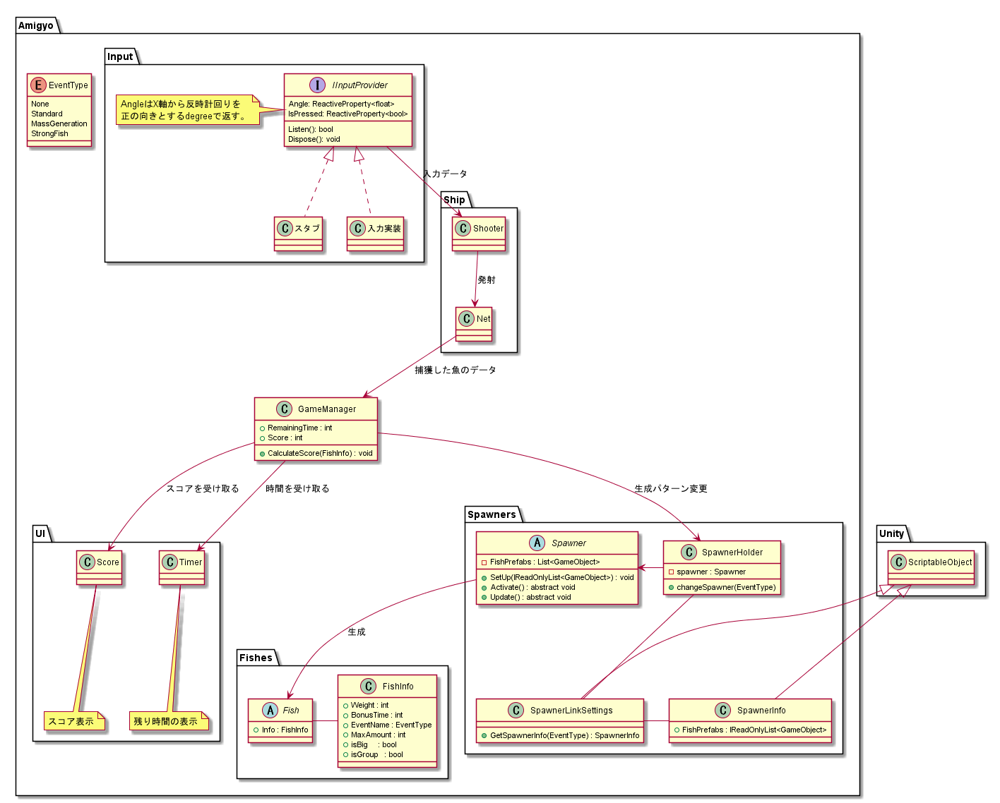

# ソフトウェア仕様

## ゲーム内容
- 自作コントローラを用いて、網で魚を捕まえるゲーム
- プレイヤーは動かない
- 魚は攻撃をしてこない
- 捕まえた魚の量、重さに応じてスコアを加算
- 終了条件：一定時間経過したら終了
- 余裕があったらイベント・ミッションなどを追加

## クラス図

## 入力・操作方法

- 入力機器はダイヤル・ボタン
    - ダイヤル: 網をとばす方向を変える
    - ボタン: 　網を飛ばす

- arduinoとのシリアル通信でボタンの信号を受け取る

## (イベント)
余裕があったら、以下のようなものを作ってみたい
- 特定の魚の大量発生
- 強い魚の発生
    - ダメージを食らったら点滅する

## 魚の種類
### 特徴
- 13 種類
- 3Dモデル
- アセットで11.5ドル
- 魚の動き、速さは、種類ごとに違う

* 一匹で来るやつ
* 4, 5匹で来るやつ
