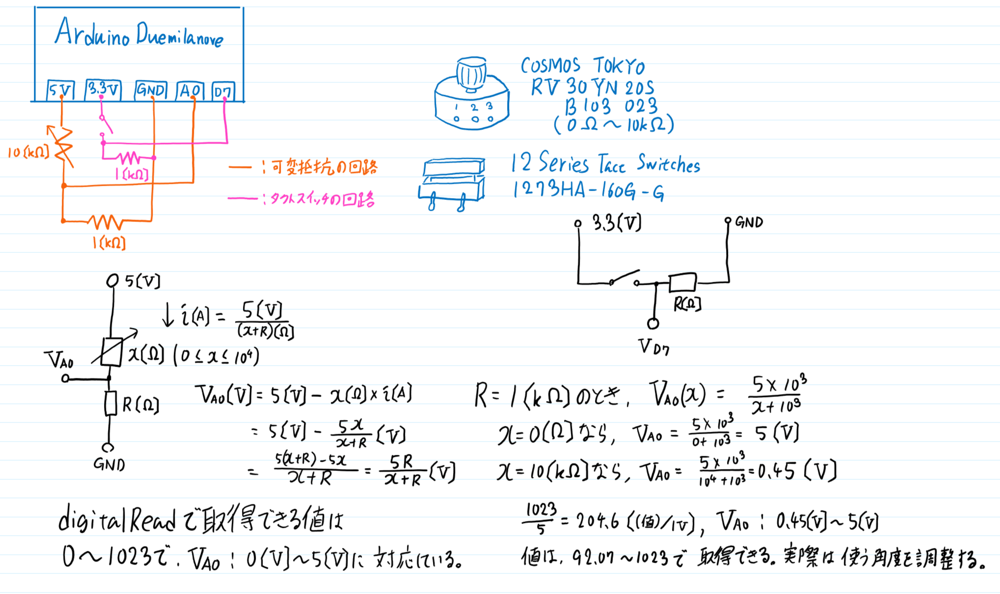

# ハードウェア仕様
本ゲームではダイヤル式のコントローラとボタンを使用する。  
Arduino Duemilanoveで制御を行う。

## 概要
下図のようなハードウェアを構成する。

ダイヤルは可変抵抗、ボタンはタクトスイッチで制作する。

## 回路図
以下に回路図を示す。

ダイヤル側の回路とボタン側の回路を分けて制作する。  
(別の入力電圧を使用する。)

### 使用する素子
以下に使用する回路素子を示す。

* 炭素皮膜抵抗 1[kΩ] x 2個
* 可変抵抗 RV30YN 20S B103 023 (10[kΩ])
* タクトスイッチ 1273HA-160G-G

### ダイヤル側の回路
図の橙色の導線で表される回路がダイヤル側の回路を示す。  
5[V]の入力電圧がArduinoから供給され、A0ピンに可変抵抗での電圧降下した電位を与える。

analogReadで取得できる値は、0から1023までの整数値で、入力電圧、今回はA0ピンの電位が0[V]のときに0となり、5[V]のときに1023となる。  
この設計では、可変抵抗の状態によって、92から1023までの整数値で取得することができる。

### ボタン側の回路
図の桃色の導線で表される回路がボタン側の回路を示す。  
3.3[V]の入力電圧がArduinoから供給され、D7ピンにタクトスイッチを通したあとの電位を与える。

### チャタリング
タクトスイッチの実装については、ラッチ回路を利用することで、回路側チャタリングを防止することにする。  
<s>詳しい実装については現在検討中。</s>

追記: 試作回路ではチャタリングが一切生じなかった。

## シリアル通信
このモジュールでは、

* 可変抵抗 (0～1023の数値)
* タクトスイッチ (0または1のビット)

を取得し、そのままの値をシリアル通信でソフトウェア部に送信する。

## ソフトウェア部
モジュールのインターフェースについては、ソフトウェアの仕様書の方で記述。  
シリアル通信を非同期でListenし、オブザーバパタンで通知する。

ゲーム部にデータを提供する前に、可変抵抗の値をx軸 (画面水平右向き) を始線とする極座標での角度 (degree, float型) に、タクトスイッチの入力値をbool値に変換する。